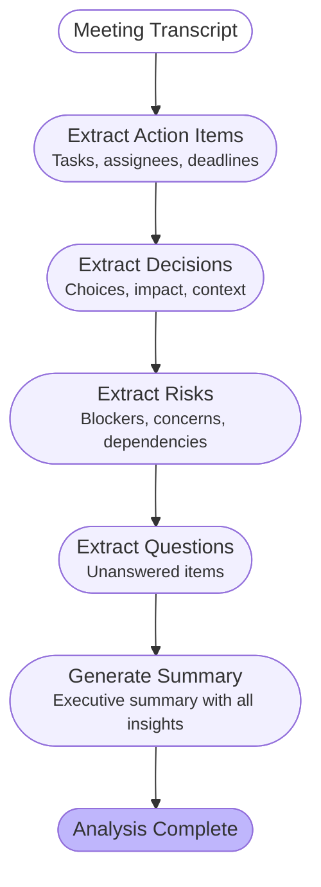

# MeetMind

**Real-Time Meeting Intelligence Agent** — An autonomous AI system that joins your meetings, transcribes conversations, and extracts actionable insights in real time.

Built with FastAPI, LangGraph, Google Gemini, Recall.ai, PostgreSQL, Redis, and WebSockets.

---

## What it does

MeetMind is an AI-powered meeting assistant that:

1. **Joins meetings automatically** as a silent participant (Google Meet, Teams, Zoom)
2. **Transcribes in real time** with speaker identification
3. **Detects insights** using a LangGraph AI agent:
   - Action items (who does what, by when)
   - Decisions taken (what was decided, impact)
   - Risks & concerns (blockers, dependencies)
   - Open questions (unanswered items needing follow-up)
4. **Generates an executive summary** when the meeting ends
5. **Streams everything** to a real-time dashboard via WebSockets

---

## Architecture

```
┌─────────────────────────────────────────────────────────────┐
│                    CLIENT (Dashboard)                         │
│  Next.js + TypeScript + Tailwind                            │
│  TranscriptPanel | InsightsPanel | MeetingList              │
└──────────────────────────┬──────────────────────────────────┘
                           │ WebSocket + REST API
┌──────────────────────────┼──────────────────────────────────┐
│                    BACKEND (FastAPI)                          │
│                          │                                   │
│  ┌───────────────────────┼───────────────────────────────┐  │
│  │  API Layer            │                               │  │
│  │  /api/v1/meetings     (CRUD + bot control)            │  │
│  │  /api/v1/webhooks     (Recall.ai events)              │  │
│  │  /ws/{meeting_id}     (real-time feed)                │  │
│  │  /health              (service status)                │  │
│  └───────────┬───────────┼──────────────┬────────────────┘  │
│              │           │              │                    │
│  ┌───────────▼──┐  ┌────▼─────┐  ┌─────▼──────────────┐   │
│  │  Services     │  │ WebSocket│  │  LangGraph Agent   │   │
│  │  Recall.ai    │  │ Manager  │  │  (5 nodes)         │   │
│  │  Transcript   │  │ (Redis   │  │                    │   │
│  │  Agent        │  │  pub/sub)│  │  See diagram below │   │
│  └──────┬────────┘  └────┬────┘  └─────────┬──────────┘   │
└─────────┼─────────────────┼─────────────────┼──────────────┘
          │                 │                 │
┌─────────▼─────────────────▼─────────────────▼──────────────┐
│                      DATA LAYER                              │
│  ┌──────────────┐  ┌───────────────────────────────────┐   │
│  │ PostgreSQL 15 │  │ Redis 7                           │   │
│  │ 7 tables      │  │ pub/sub: transcript, insights,    │   │
│  │ + Alembic     │  │          meeting status           │   │
│  └──────────────┘  └───────────────────────────────────┘   │
└─────────────────────────────────────────────────────────────┘
          │
┌─────────▼─────────────────────────────────────────────────┐
│                   EXTERNAL SERVICES                         │
│  ┌────────────┐  ┌─────────────┐                          │
│  │ Recall.ai  │  │ Google      │                          │
│  │ (meeting   │  │ Gemini 3.5  │                          │
│  │  bot +     │  │ Flash (LLM) │                          │
│  │  transcript)│  │             │                          │
│  └────────────┘  └─────────────┘                          │
└───────────────────────────────────────────────────────────┘
```

---

## AI Agent — LangGraph Orchestration

The meeting intelligence agent is built with LangGraph, processing transcripts through a pipeline of specialized nodes:



**How it works:**

| Node | Model | What it does |
|------|-------|-------------|
| `extract_action_items` | Gemini 3.5 Flash | Detects tasks with assignee + deadline + priority |
| `extract_decisions` | Gemini 3.5 Flash | Identifies decisions with context + impact |
| `extract_risks` | Gemini 3.5 Flash | Finds risks by category (technical, timeline, resource, dependency) |
| `extract_questions` | Gemini 3.5 Flash | Tracks unanswered questions needing follow-up |
| `generate_summary` | Gemini 3.5 Flash | Creates structured executive summary using all detected insights |

Each node applies a confidence threshold (≥ 0.75) to minimize false positives.

---

## Data Flow

```
1. User creates meeting via API
   POST /api/v1/meetings {url, title, platform}
       ↓
2. Recall.ai bot joins the meeting
   Bot → Google Meet/Teams/Zoom
       ↓
3. Meeting ends → Recall.ai processes recording
   Webhook: bot.done → Backend
       ↓
4. Backend fetches transcript
   Recall.ai API → TranscriptChunks → PostgreSQL
       ↓
5. LangGraph Agent analyzes transcript
   Transcript → 5 nodes → Insights → PostgreSQL + Redis
       ↓
6. Real-time delivery to clients
   Redis pub/sub → WebSocket → Dashboard
```

---

## Tech Stack

| Layer | Technology | Why |
|-------|-----------|-----|
| **API** | FastAPI 0.104 | Async-native, auto-docs, type-safe |
| **Database** | PostgreSQL 15 + SQLAlchemy 2.0 | ACID, relational model for meetings ↔ insights |
| **Migrations** | Alembic | Schema evolution control |
| **Cache/PubSub** | Redis 7 | Sub-ms pub/sub for real-time WebSocket distribution |
| **AI Agent** | LangGraph 1.2 | Stateful graph orchestration for multi-step analysis |
| **LLM** | Google Gemini 3.5 Flash | Free tier, fast, accurate JSON extraction |
| **Meeting Bot** | Recall.ai | Managed bot infrastructure for all platforms |
| **Real-time** | WebSockets + Redis pub/sub | Live transcript + insight delivery |
| **Containers** | Docker + Docker Compose | Reproducible dev/prod environments |
| **Testing** | pytest + pytest-asyncio | 29 tests, mocked external services |

---

## Database Schema

```
┌──────────────┐    ┌──────────────────┐    ┌──────────────┐
│   meetings   │───<│ transcript_chunks │    │ action_items │
│              │    └──────────────────┘    │              │
│ id           │                            │ task         │
│ title        │───<┌──────────────────┐    │ assignee     │
│ meeting_url  │    │    decisions      │    │ deadline     │
│ platform     │    └──────────────────┘    │ priority     │
│ status       │                            │ confidence   │
│ recall_bot_id│───<┌──────────────────┐    └──────────────┘
│ participants │    │      risks       │
│ scheduled_at │    └──────────────────┘
│ started_at   │
│ ended_at     │───<┌──────────────────┐
└──────────────┘    │  open_questions  │
        │           └──────────────────┘
        │
        └───<┌──────────────────┐
             │ meeting_summaries│
             └──────────────────┘
```

7 tables with full relational integrity and cascade deletes.

---

## API Endpoints

| Method | Endpoint | Description |
|--------|----------|-------------|
| `GET` | `/health/` | Service health (API, DB, Redis) |
| `POST` | `/api/v1/meetings/` | Create meeting + send bot |
| `GET` | `/api/v1/meetings/` | List meetings (paginated) |
| `GET` | `/api/v1/meetings/{id}` | Get meeting details |
| `PUT` | `/api/v1/meetings/{id}` | Update meeting |
| `DELETE` | `/api/v1/meetings/{id}` | Delete meeting |
| `GET` | `/api/v1/meetings/{id}/bot-status` | Recall.ai bot status |
| `POST` | `/api/v1/webhooks/recall` | Receive Recall.ai events (Svix) |
| `WS` | `/ws/{meeting_id}` | Real-time transcript + insights stream |

Full OpenAPI documentation available at `/docs` when running.

---

## Real-Time WebSocket Protocol

Clients connect to `/ws/{meeting_id}` and receive JSON messages:

```json
// Transcript chunk arrives
{"type": "transcript_chunk", "data": {"text": "...", "speaker": "Luis", "start_time": 10.5}}

// Insight detected
{"type": "insight_detected", "data": {"insight_type": "action_item", "data": {"task": "...", "assignee": "..."}}}

// Meeting status change
{"type": "status_update", "data": {"status": "in_progress", "event": "bot.in_call_recording"}}
```

---

## Quick Start

### Prerequisites
- Docker + Docker Compose v2
- Recall.ai API key ([recall.ai](https://recall.ai))
- Google Gemini API key ([aistudio.google.com](https://aistudio.google.com/apikey))

### Setup

```bash
# Clone
git clone https://github.com/your-user/meetmind.git
cd meetmind

# Configure environment
cp .env.example .env
# Edit .env with your API keys

# Start all services
docker compose up -d --build

# Run database migrations
docker compose exec backend alembic upgrade head

# Verify
curl http://localhost:8001/health/
# {"status": "healthy", "services": {"api": "healthy", "database": "healthy", "redis": "healthy"}}
```

### Run Tests

```bash
docker compose exec backend pytest tests/ -v
# 29 passed
```

### Send a bot to a meeting

```bash
# Create a Google Meet at meet.new, then:
docker compose exec backend python scripts/test_recall_bot.py "https://meet.google.com/YOUR-URL"
```

---

## Project Structure

```
meetmind/
├── backend/
│   ├── app/
│   │   ├── agents/                 # LangGraph AI agent
│   │   │   ├── meeting_agent.py    # Graph definition + nodes
│   │   │   ├── state.py           # AgentState TypedDict
│   │   │   └── prompts/           # LLM prompt templates
│   │   ├── api/routes/            # FastAPI endpoints
│   │   │   ├── health.py         # Health check
│   │   │   ├── meetings.py       # CRUD + bot control
│   │   │   ├── webhooks.py       # Recall.ai events (Svix)
│   │   │   └── websockets.py     # Real-time feed (Redis pub/sub)
│   │   ├── core/config.py        # Pydantic Settings
│   │   ├── db/                    # Database + Redis managers
│   │   ├── models/               # SQLAlchemy models (7 tables)
│   │   ├── schemas/              # Pydantic request/response schemas
│   │   └── services/             # Business logic
│   │       ├── recall_service.py  # Recall.ai API client
│   │       ├── transcript_service.py  # Fetch + store transcripts
│   │       └── agent_service.py   # Orchestrate agent + persist results
│   ├── tests/                     # 29 tests
│   ├── alembic/                   # Database migrations
│   ├── Dockerfile
│   └── requirements.txt
├── dashboard/                     # Next.js frontend (Phase 4)
├── docs/                          # Technical documentation
├── scripts/                       # Utility scripts
├── docker-compose.yml
└── .env.example
```

---

## Example Output

Given this meeting transcript:

> **Luis:** El tema es el lanzamiento del producto para el mes que viene.
> **María:** Necesitamos cerrar el diseño de la landing esta semana.
> **Luis:** María, te encargas del diseño para el viernes?
> **Carlos:** Me preocupa que no tenemos la API de pagos confirmada.
> **Luis:** Decidido: si para el jueves no hay respuesta, tiramos con Stripe.

The agent produces:

**Action Items:**
| Task | Assignee | Deadline | Priority |
|------|----------|----------|----------|
| Tener listo el diseño de la landing page | María | viernes | high |
| Pasar textos definitivos | Carlos | mañana | medium |
| Verificar dominio registrado | Carlos | hoy | medium |

**Decisions:**
- Utilizar Stripe directamente como plan B si para el jueves no hay respuesta del backend sobre la API de pagos (impact: medium)

**Risks:**
- Falta de confirmación del equipo de backend sobre la API de pagos (category: dependency, severity: high)

**Open Questions:**
- ¿Tenemos el dominio registrado para la landing? (asked by: Carlos)

---

## Design Decisions

| Decision | Rationale |
|----------|-----------|
| **Gemini over OpenAI** | Free tier, sufficient quality for structured extraction |
| **Recall.ai for meeting bots** | Managed infrastructure, multi-platform support |
| **LangGraph over plain functions** | Portfolio value + extensible for future features (conditional routing, loops) |
| **Redis pub/sub for real-time** | Decouples webhook processing from WebSocket delivery |
| **Sequential nodes (not parallel)** | Simpler, and summary needs all prior results |
| **Confidence threshold 0.75** | Balances recall vs precision — reduces false positives |
| **Alembic over create_all** | Production-ready schema management |

---

## Status

| Phase | Status | Description |
|-------|--------|-------------|
| Phase 1: Infrastructure | ✅ Complete | Docker, DB, Redis, API, tests, migrations |
| Phase 2: Recall.ai | ✅ Complete | Bot joins meetings, transcription stored, WebSocket working |
| Phase 3: AI Agent | ✅ Complete | LangGraph + Gemini detecting all insight types |
| Phase 4: Dashboard | 🚧 Next | Next.js real-time UI |
| Phase 5: Deploy | ⬜ Pending | AWS EC2 + NGINX + SSL + CI/CD |
| Phase 6: Integrations | ⬜ Optional | Jira/Notion sync |

---

## Author

**Luis López León**
Backend / AI Engineer

---

*Built as a technical project demonstrating: AI agent design (LangGraph), microservice architecture (FastAPI + PostgreSQL + Redis), real-time systems (WebSockets + pub/sub), and API integrations (Recall.ai + Gemini).*
