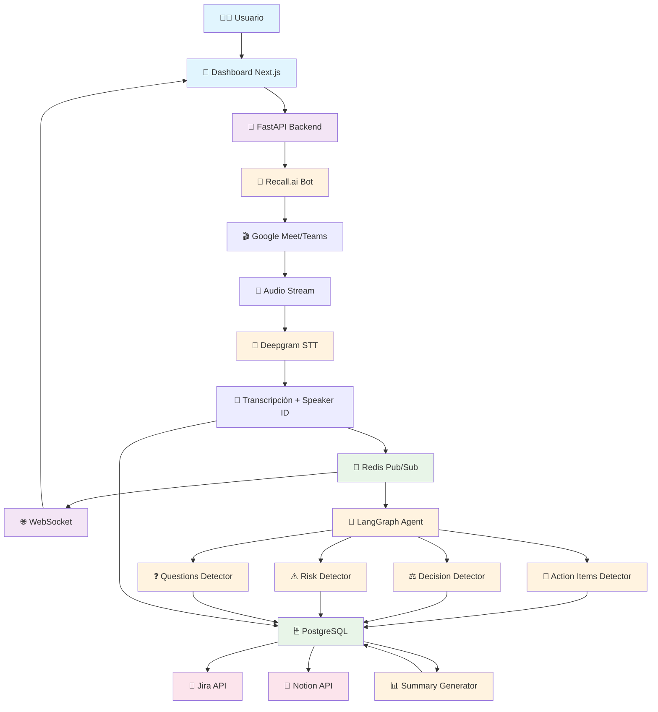
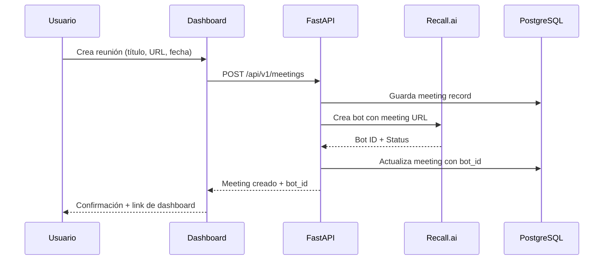
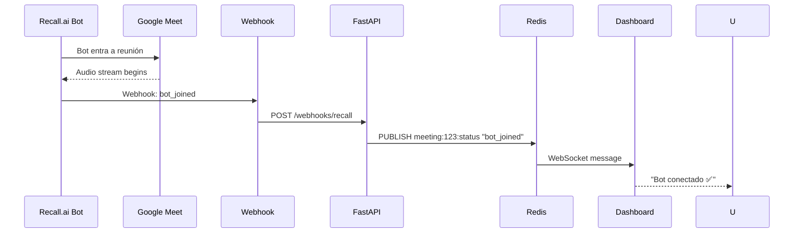
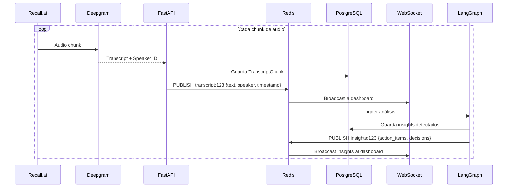
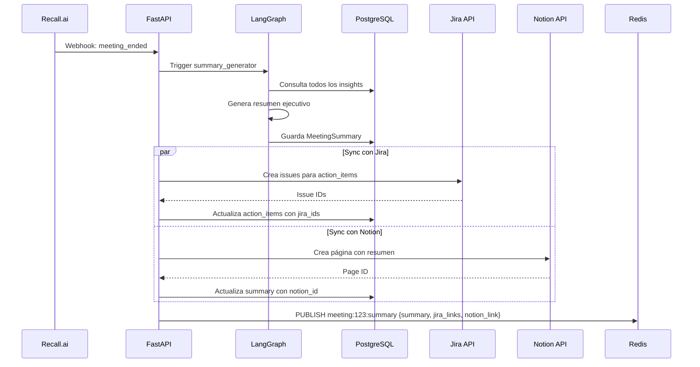
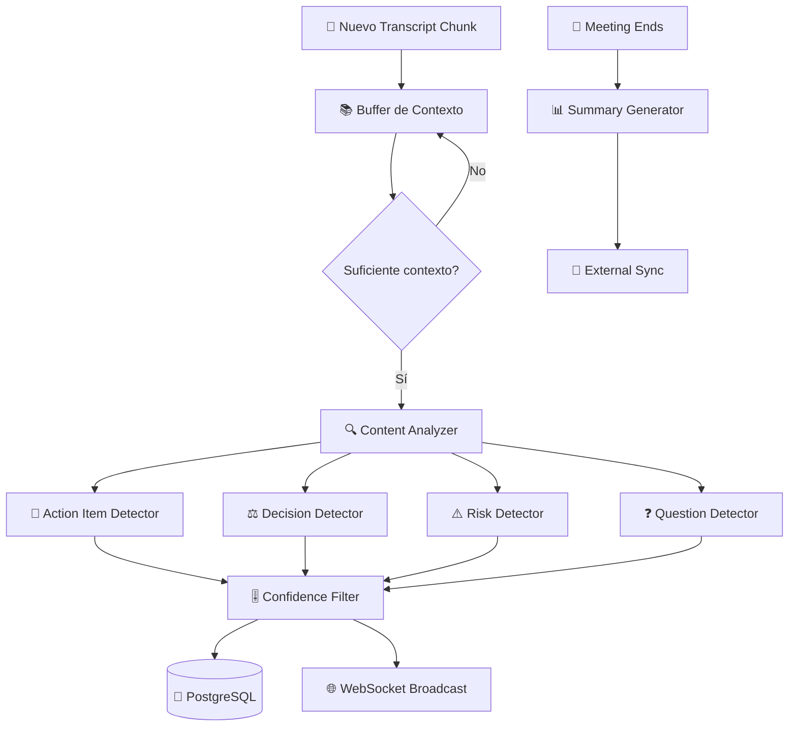

# 2. Arquitectura Técnica

## 🏗️ Diagrama de Arquitectura General



## 🛠️ Stack Tecnológico Detallado

### Backend Core
```yaml
Framework: FastAPI 0.104.1
Language: Python 3.11
ASGI Server: Uvicorn + Gunicorn (producción)
```

**Justificación:**
- **FastAPI**: Mejor performance que Flask/Django para APIs, documentación automática, type hints nativos
- **Python 3.11**: Soporte nativo para async/await, mejor performance que 3.10
- **Uvicorn**: ASGI server con mejor handling de WebSockets que WSGI

### Base de Datos
```yaml
Primary DB: PostgreSQL 15
ORM: SQLAlchemy 2.0 + Alembic
Cache/Pub-Sub: Redis 7
Connection Pool: Configurado para 20 conexiones concurrentes
```

**Justificación:**
- **PostgreSQL**: ACID compliance, mejor para datos relacionados (meetings ↔ transcripts ↔ action_items)
- **SQLAlchemy 2.0**: Query syntax moderna, mejor type safety
- **Redis**: Pub/Sub para tiempo real + cache para sessiones/temporales

### AI & Processing
```yaml
Agent Framework: LangGraph 0.0.38
LLM: OpenAI GPT-4o-mini (detección) + GPT-4o (resúmenes)
STT: Deepgram Nova-3 Streaming
Meeting Bot: Recall.ai SDK
```

**Justificación:**
- **LangGraph**: Mejor que LangChain vanilla para agentes con estado complejo
- **GPT-4o-mini**: 10x más barato, suficiente para extracción estructurada
- **Deepgram**: Latencia más baja que AssemblyAI, mejor diarización
- **Recall.ai**: Evita complejidad de WebRTC custom, API unificada para todas las plataformas

### Frontend & Real-time
```yaml
Framework: Next.js 15 + TypeScript
Styling: Tailwind CSS 3.4
Real-time: WebSockets + Server-Sent Events
State Management: React Query + Zustand
```

**Justificación:**
- **Next.js 15**: SSR + CSR híbrido, mejor SEO, App Router estable
- **TypeScript**: Type safety end-to-end con backend
- **Tailwind**: Rapid prototyping, consistent design system
- **WebSockets**: Bidireccional para comandos + real-time updates

### DevOps & Deploy
```yaml
Containerización: Docker + Docker Compose
CI/CD: GitHub Actions
Deploy: AWS EC2 + NGINX
SSL: Let's Encrypt (Certbot)
Monitoring: Loguru + Prometheus (opcional)
```

**Justificación:**
- **Docker**: Consistent environments dev/prod
- **GitHub Actions**: Free para repos públicos, integración nativa
- **AWS EC2**: Balance costo/control, evita vendor lock-in de serverless
- **NGINX**: Reverse proxy + load balancing + SSL termination

## 🔄 Flujo de Datos Completo

### 1. Creación de Reunión


### 2. Bot Entra a Reunión


### 3. Transcripción en Tiempo Real


### 4. Finalización y Resumen


## 🧠 Arquitectura del Agente LangGraph

### Grafo de Estados
```python
# Nodos del grafo
nodes = {
    "transcription_buffer": accumulate_transcripts,
    "content_analyzer": analyze_content,  
    "action_item_extractor": detect_action_items,
    "decision_extractor": detect_decisions,
    "risk_detector": detect_risks,
    "question_tracker": track_open_questions,
    "confidence_filter": filter_low_confidence,
    "summary_generator": generate_summary
}

# Estado compartido entre nodos
state = {
    "meeting_id": int,
    "transcript_chunks": List[str],
    "raw_insights": Dict,
    "filtered_insights": Dict,
    "confidence_threshold": float,
    "context_window": int
}
```

### Flujo de Decisiones


## 📊 Escalabilidad y Performance

### Métricas Target
- **Latencia de transcripción**: < 2 segundos from speech to dashboard
- **Detección de insights**: < 5 segundos from transcript to classified insight  
- **Concurrencia**: 10 reuniones simultáneas en single instance
- **Throughput**: 100 transcript chunks/segundo
- **Availability**: 99.5% uptime

### Estrategias de Optimización
1. **Connection Pooling**: PostgreSQL pool optimizado para read/write ratio
2. **Redis Pub/Sub**: Evita polling, reduce latencia de real-time updates
3. **Async Processing**: Todo el pipeline es asíncrono desde audio hasta insights
4. **Batch Inference**: LangGraph procesa múltiples chunks en single call
5. **Caching Strategy**: Insights temporales en Redis, persistencia en PostgreSQL

### Puntos de Monitoreo
```yaml
Application Metrics:
  - transcript_processing_latency_seconds
  - insight_detection_accuracy_ratio
  - websocket_connection_count
  - meeting_concurrent_active_count

Infrastructure Metrics:  
  - postgresql_connection_pool_usage
  - redis_memory_usage_bytes
  - cpu_usage_percent
  - memory_usage_percent
```

## 🔒 Consideraciones de Seguridad

### API Security
- **Rate Limiting**: 100 requests/minute per IP
- **CORS**: Configurado solo para dominios autorizados
- **Input Validation**: Pydantic schemas en todas las endpoints
- **SQL Injection**: SQLAlchemy ORM + parameterized queries

### Data Security  
- **Encryption in Transit**: HTTPS/WSS en todas las comunicaciones
- **API Keys**: Almacenadas como variables de entorno, nunca en código
- **Webhook Validation**: HMAC signature validation para Recall.ai webhooks
- **Data Retention**: Auto-delete transcripts > 30 días (GDPR compliance)

### Infrastructure Security
- **Container Security**: Non-root users, minimal base images
- **Network Security**: Internal Docker network, expose solo puertos necesarios
- **SSL/TLS**: Let's Encrypt certificates con auto-renewal
- **Backup Strategy**: Daily PostgreSQL backups a S3

---

*Documento actualizado: 12 Agosto 2026*